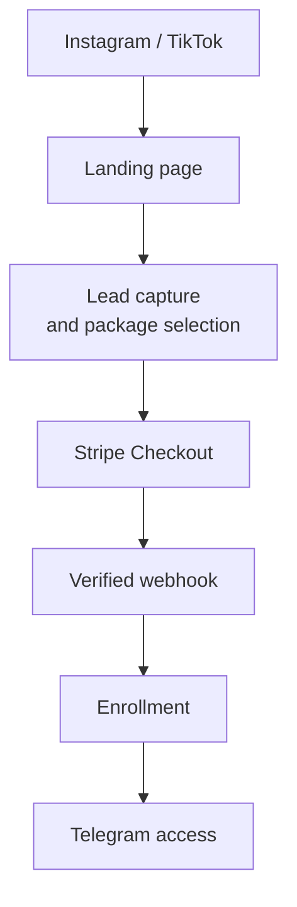

# Ileristy Creator Platform

An end-to-end course commerce and delivery platform for a personal-brand business focused on **UGC creation** and **social media management**.

The platform is designed to turn social traffic into a fully automated customer journey:



> **Project status:** early development. The domain model and MVP architecture are being designed; application scaffolding and features are being added incrementally.

## Why this project exists

The first release supports a cohort-based course run through two private Telegram spaces:

- a content channel for lessons, announcements, and live-call links;
- a community group for discussion, homework, and feedback.

The website explains the offer, captures leads, sells course packages, and collects payment. After a payment is verified, the backend enrolls the customer and grants the appropriate Telegram access automatically.

This is also a portfolio project built to demonstrate practical Java backend engineering: domain modelling, transactions, idempotency, integrations, testing, observability, and evolutionary architecture.

## MVP scope

- Public course landing page and package catalogue
- Lead capture with explicit marketing consent
- Cohort and capacity management
- Order creation with server-side price calculation
- Stripe Checkout and signed webhook processing
- Idempotent payment and enrollment workflow
- Telegram identity linking and access grants
- Email and Telegram notifications
- Basic operational/admin endpoints
- Audit-friendly timestamps and status transitions

Not part of the first release: a custom video-learning UI, native mobile apps, an advanced CRM, or AI in the payment/access critical path.

## Architecture

The initial architecture is a **modular monolith**. It keeps deployment and local development simple while preserving clear domain boundaries.

### Core modules

| Module | Responsibility |
|---|---|
| Contacts | Leads, customer details, consent |
| Catalogue | Courses, packages, cohorts |
| Orders | Price snapshot, order lifecycle |
| Payments | Stripe integration, webhook deduplication |
| Enrollments | Course access state |
| Telegram | Identity linking, channel/group grants |
| Notifications | Email and Telegram delivery |
| AI feedback | Asynchronous homework analysis, added after the core flow |

External integrations are accessed through application ports so that providers can be replaced and tested without changing domain logic.

### Critical business flow

1. A visitor selects a package and submits contact details.
2. The backend validates the package, cohort, currency, and current price.
3. The backend creates an order and a Stripe Checkout session.
4. Stripe sends a webhook after payment.
5. The backend verifies the signature and deduplicates the event.
6. A successful payment activates an enrollment.
7. Telegram access and notifications are processed independently.

The browser redirect is never treated as proof of payment.

## Technology stack

### Web

- Next.js and TypeScript
- Tailwind CSS and shadcn/ui
- React Hook Form and Zod

### Core API

- Java 25
- Spring Boot 4.1
- Spring MVC
- Spring Data JPA / Hibernate
- Bean Validation
- Spring Security
- Spring Boot Actuator
- Liquibase
- OpenAPI
- Maven

### Data and infrastructure

- PostgreSQL
- Neon for hosted environments
- Docker Compose for local development
- Testcontainers for integration tests
- GitHub Actions for CI/CD, GHCR for backend images
- Vercel for the web app and PR previews
- Trivy and Dependabot for security scanning and dependency updates

The delivery pipeline (PR checks, staging, approval-gated production, controlled Liquibase migrations) is described in [docs/ci-cd.md](docs/ci-cd.md).

### Integrations

- Stripe Checkout and webhooks
- Telegram Bot API
- Pluggable email provider

### AI extension

The later AI feedback module will use a separate Python worker:

- Python 3.13
- FastAPI and Pydantic
- RabbitMQ
- Structured model output with schema validation
- Prompt versioning and evaluation datasets
- pgvector only when retrieval becomes necessary

AI processing is asynchronous and never blocks payment, enrollment, or Telegram access.

## Domain model

The MVP centres on these entities:

- `contact`
- `course`
- `course_package`
- `cohort`
- `course_order`
- `payment`
- `enrollment`
- `telegram_identity`
- `telegram_access_grant`
- `webhook_event`
- `outbox_event`

Later AI capabilities add `content_submission`, `ai_feedback_job`, `ai_feedback_result`, and `prompt_version`.

## Engineering invariants

- Prices are calculated and snapshotted by the backend.
- Payment is accepted only from a verified provider webhook.
- Replayed webhooks cannot create duplicate payments or enrollments.
- Notification or Telegram failures cannot roll back a successful payment.
- Money is stored in minor units with an explicit ISO currency.
- Card data is never stored by this application.
- AI is isolated from the transactional core.
- Production secrets and personal customer data are never committed.

## Planned repository structure

```text
ileristy-creator-platform/
├── apps/
│   └── web/
├── services/
│   ├── core-api/
│   └── ai-worker/
├── .github/
│   └── workflows/
├── docs/
│   ├── ci-cd.md
│   ├── adr/
│   ├── diagrams/
│   └── product/
├── infra/
│   └── docker/
├── docker-compose.yml
├── .env.example
└── README.md
```

## Local development

The commands below describe the target workflow and will become executable as the corresponding scaffolding lands.

### Prerequisites

- JDK 25
- Docker with Docker Compose
- Node.js LTS
- Maven, or the included Maven Wrapper once generated

### Start local infrastructure

```bash
cp .env.example .env
docker compose up -d postgres
```

### Run the API

```bash
cd services/core-api
./mvnw spring-boot:run
```

### Run the web application

```bash
cd apps/web
npm install
npm run dev
```

Never place real Stripe, Telegram, Neon, or email credentials in committed configuration.

## Testing strategy

The project favours testing behaviour at the lowest useful level:

- **Unit tests:** domain rules, state transitions, validation
- **Spring integration tests:** persistence, transactions, security, REST contracts
- **Testcontainers:** PostgreSQL behaviour and Liquibase migrations
- **WireMock/fakes:** Stripe, Telegram, and email boundaries
- **End-to-end tests:** purchase-to-enrollment happy path and critical failures
- **AI evaluations:** fixed datasets, structured-output checks, and prompt-version regression tests

Primary Java tools: JUnit 5, AssertJ, Mockito, MockMvc, Testcontainers, and WireMock. Frontend tests will use Vitest, React Testing Library, and Playwright; the AI worker will use pytest.

## Architecture decisions

Architecture Decision Records are kept in `docs/adr`. The initial set will document:

- modular monolith for the MVP;
- Neon-hosted PostgreSQL;
- payment webhook as the source of truth;
- Telegram access model;
- AI outside the transactional critical path.

## Roadmap

- [ ] Finalize the PostgreSQL schema and Liquibase baseline
- [ ] Scaffold the Spring Boot API and Next.js application
- [ ] Deliver the first vertical slice: Next.js → Spring Boot → PostgreSQL
- [ ] Add CI/CD: PR checks, Docker image, staging and approval-gated production ([plan](docs/ci-cd.md))
- [ ] Implement contacts, catalogue, and cohorts
- [ ] Implement orders and server-side pricing
- [ ] Add Stripe Checkout and idempotent webhooks
- [ ] Add enrollment and Telegram access
- [ ] Add notifications and operational tooling
- [ ] Add observability and production hardening
- [ ] Introduce the asynchronous AI feedback worker

## Development approach

AI tools may assist with boilerplate, documentation, and review. Domain modelling, security decisions, transaction boundaries, idempotency, and critical integration behaviour are designed, reviewed, and tested explicitly.

## License and usage

Copyright © 2026. All rights reserved.

This repository is public for portfolio and demonstration purposes. It is not currently offered under an open-source license. Course materials, production configuration, credentials, and customer data are not included.
