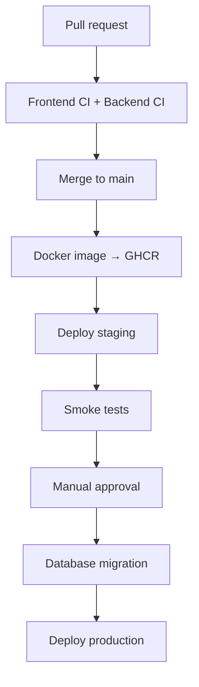

# CI/CD

> **Status:** planned. Implementation starts after the first working vertical slice (Next.js → Spring Boot → PostgreSQL). Until then this document is the target design.

The goal is a production-like delivery process without premature infrastructure: immutable Docker images, automated staging deployments, controlled database migrations, security scanning, and approval-gated production releases. Kubernetes, Terraform, and AWS ECS are deliberately deferred to a later infrastructure milestone.

## Pipeline



## Tooling

| Concern | Tool |
|---|---|
| CI/CD orchestration | GitHub Actions |
| Backend image registry | GitHub Container Registry (GHCR) |
| Web hosting and PR previews | Vercel |
| Hosted PostgreSQL | Neon (separate staging and production projects) |
| Backend hosting (initial) | Render, Railway, or Fly.io |
| Schema migrations | Liquibase |
| Local infrastructure | Docker Compose |
| Integration tests | Testcontainers |
| Dependency updates | Dependabot |
| Image and dependency scanning | Trivy |

## Pull request checks

Every pull request must pass CI before it can be merged. This is enforced with branch protection on `main`.

### Backend (`services/core-api`)

1. Compile
2. Unit tests
3. Architecture tests (module boundaries)
4. Integration tests against PostgreSQL via Testcontainers
5. Liquibase validation: changelog validates and applies cleanly to an empty database
6. Package
7. Docker build

### Frontend (`apps/web`)

1. Install dependencies (lockfile-exact)
2. ESLint
3. TypeScript check
4. Unit tests
5. Production build
6. Playwright smoke tests

### Shared

- Formatting checks
- Secret scanning to catch committed credentials
- Dependency and security scan (Trivy)
- Docker build verification

## Environments

| Environment | Purpose | Deployment |
|---|---|---|
| Local | Development | Docker Compose |
| Preview | Review of each PR | Vercel, automatic |
| Staging | Integration verification | Automatic after merge to `main` |
| Production | Real customers | After manual approval |

Staging and production are fully isolated. Each has its own:

- Neon database;
- Stripe API keys and webhook signing secret;
- Telegram bot, or at minimum separate channel and group;
- environment variables and secrets;
- domains and callback URLs (Stripe success/cancel, webhooks, Telegram).

## Workflow layout

Start with three workflows:

```text
.github/workflows/
├── ci.yml                  # backend + frontend + shared checks on PRs and main
├── deploy-staging.yml      # build/push image, migrate, deploy, smoke test
└── deploy-production.yml   # approval-gated promotion of a staging-verified image
```

Split them when the pipeline grows:

```text
.github/workflows/
├── backend-ci.yml
├── frontend-ci.yml
├── security.yml
├── deploy-staging.yml
└── deploy-production.yml
```

## Deployment rules

- **Immutable images.** Each image is tagged with the commit SHA. Production deploys the exact image that passed staging; it is never rebuilt.
- **Migrations are a separate job.** Application instances do not run Liquibase on startup (`spring.liquibase.enabled=false` in deployed profiles). A dedicated deployment job applies migrations before the new backend version starts.
- **Order:** migrate the database, then deploy the new application version, then run smoke tests.
- **Backward-compatible migrations.** A migration must work with both the currently running and the new application version (expand/contract). Destructive changes ship in a later release, after no running version depends on the old schema.
- **Rollback.** If a deployment fails, roll back the application to the previous image tag. The database is not rolled back.
- **Applied changesets are immutable.** A changeset that has run in production is never edited or deleted; fixes ship as new corrective changesets.
- **Approval-gated production.** Production deployment runs in a protected GitHub Environment that requires manual approval.
- **No secrets in the repository or images.** Secrets live in GitHub Environments and the hosting provider. Images receive configuration at runtime only.
- **Smoke tests.** After each deployment, `GET /actuator/health` must report `UP` before the deployment is considered successful.

## Implementation phases

1. Backend and frontend CI
2. Spring Boot Dockerfile
3. Local `docker-compose.yml`
4. Automatic staging deployment
5. Production deployment with manual approval
6. Post-deploy smoke test on `/actuator/health`
7. Security scanning and Dependabot
8. Later: Terraform, AWS ECS, and OpenTelemetry
